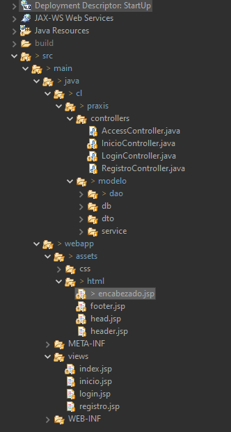
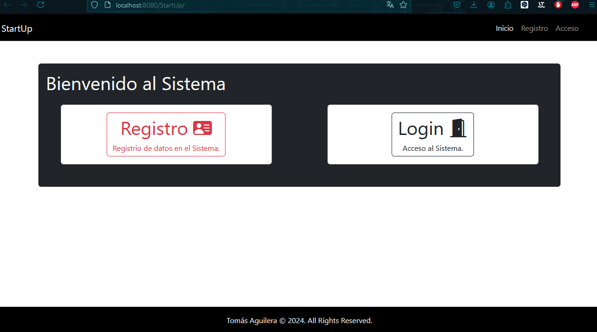
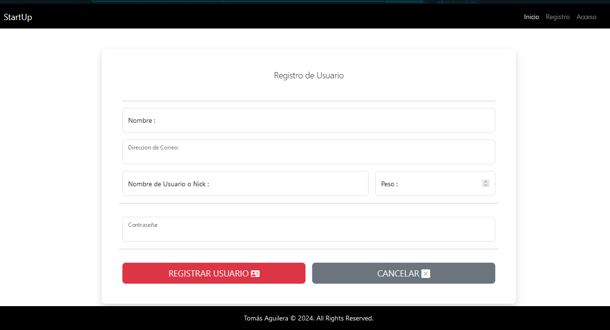
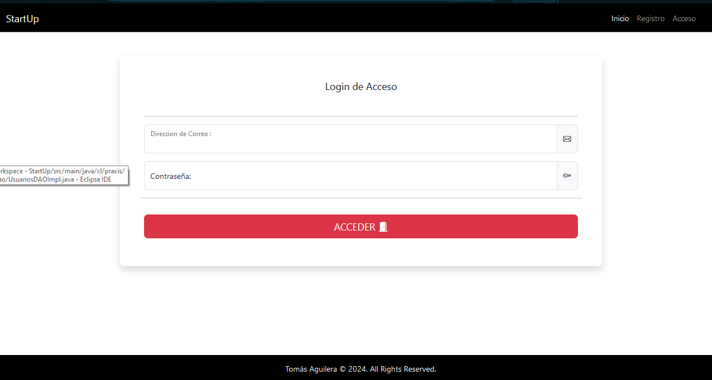
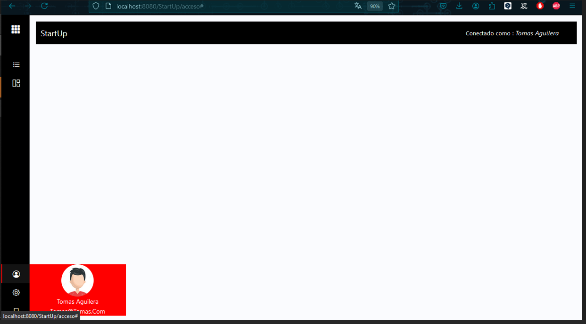

Desafío - El patrón de diseño MVC y despliegue
de una aplicación
--

En este desafío validaremos nuestros conocimientos para desplegar una aplicación usando el patrón MVC.

Para lograrlo, necesitarás aplicar todo lo aprendido desde la Unidad 3 – Capa acceso de datos.

Lee todo el documento antes de comenzar el desarrollo individual, para asegurarte de tener el máximo de puntaje y enfocar bien los esfuerzos.

Tiempo asociado: 2 horas cronológicas.

Descripción
-

Una StartUp ha solicitado la creación del Core de un sistema de gestión y administración de trabajadores, para ello han requerido la creación de las pantallas de Registro y Login de
usuarios que permita controlar los accesos al aplicativo. 

El equipo encargado de la estructura de la base de datos, ha construido el siguiente modelo, que cumple con los requerimientos de esta primera etapa:

  

Mediante la utilización del IDE de desarrollo Eclipse, se debe crear un nuevo proyecto Web Dinámico llamado “StartUp”. 

Este proyecto debe ser desplegado bajo el servidor Web Apache
Tomcat 9 o 10.

Una vez creado el proyecto, se debe crear la página <b><i>“index.jsp”</i></b>, la cual es el JSP de entrada,
en donde se debe visualizar un mensaje de bienvenida y 2 botones, los cuales redirigen al Registro y al Login.

Requerimientos
--

1. Crear un nuevo proyecto Java Web Dinámico de Nombre “StartUp”. 

(1 Punto)

2. Crear la estructura para el archivo index.jsp correspondiente a la vista requerida,
considerando el envío de los datos hacia el Servlet.

(1 Puntos).

3. Desplegar formulario registro.jsp para la captura de los datos del usuario según
modelo de base datos y realizar la persistencia en base datos.

(2 Puntos)

4. Realizar lógica de negocio en la creación de usuario validando la existencia del usuario
a través del correo.

(2 Puntos)

5. Desplegar formulario login.jsp para la captura de los datos de ingreso solicitando
correo y password y realizar las validaciones de existencia en base datos.

(2 Puntos)

6. Desplegar pantalla home.jsp con mensaje de acceso al sistema mostrando el nombre
y correo del usuario.

(2 Puntos)

¡Mucho éxito

Imagenes del proyecto Realizado
-

Imagen 1

Imagen 2

Imagen 3

Imagen 4

Imagen 5 

Imagen 6

